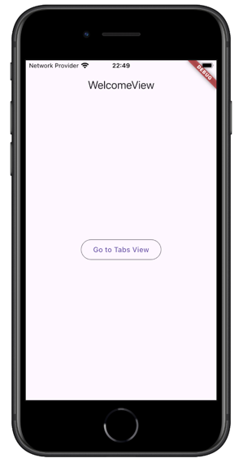
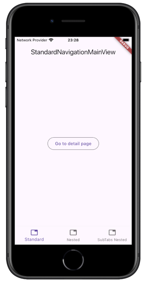
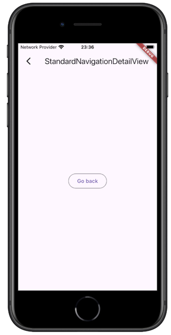
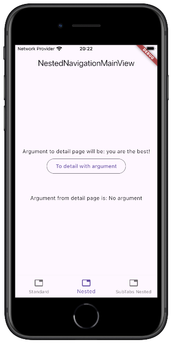
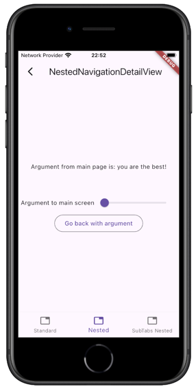
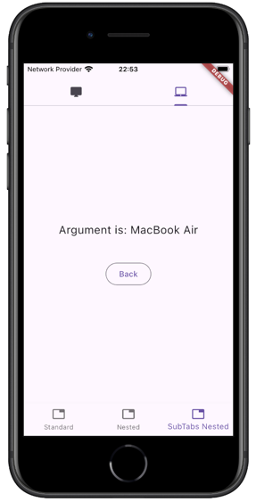

# Nested navigation using GetX package 

This is a simple example of how to implement standard and nested navigation using the GetX package.

## Getting Started

When you run this project, you'll see the following interface:


This button takes you to a screen with a BottomNavigationBar that contains three examples:
 - [Simple Navigation](##Simple-Navigation)
 - [Nested Navigation](##Nested-Navigation)
 - [Nested Navigation with Tab Bar](##Nested-Navigation-with-Tab-Bar)

 Let's take a closer look at these examples.

 ## Simple Navigation

 To navigate to the detail screen, we can use named routing:
 ```dart
 Get.toNamed(Routes.STANDARD_NAVIGATION_DETAIL)
 ```
The detail screen overlays the entire screen, including the BottomNavigationBar.
<p float="left">
  
   
</p>

 ## Nested Navigation

 First, we need to create a navigator that contains the entire navigation route chain, including the parent and its detail screen:
 ```dart
 Navigator(
    key: Get.nestedKey(Constants.nestedNavigationNavigatorId),
    initialRoute: Routes.NESTED_NAVIGATION_MAIN,
    onGenerateRoute: (routeSettings) {
    if (routeSettings.name == Routes.NESTED_NAVIGATION_MAIN) {
        return MaterialPageRoute(builder: (context) {
        return NestedNavigationMainView();
        });
    } else if (routeSettings.name ==
        Routes.NESTED_NAVIGATION_DETAIL) {
        return GetPageRoute(
        routeName: Routes.NESTED_NAVIGATION_DETAIL,
        page: () => NestedNavigationDetailView(
            argument: routeSettings.arguments as String,
        ),
        binding: NestedNavigationDetailBinding()
        );
    }
  },
)
 ```

An important aspect here is the ```Constants.nestedNavigationNavigatorId``` constant, which must be used in the navigation function:
 ```dart
Get.toNamed(Routes.NESTED_NAVIGATION_DETAIL,
        arguments: argumentToDetailPage.value,
        id: Constants.nestedNavigationNavigatorId);
 ```


When navigation back we must use the same id
 ```dart
Get.back(result: controller.count.value, id: Constants.nestedNavigationNavigatorId)
 ```
<p float="left">
  
   
</p>

 ## Nested Navigation with Tab Bar
 It's the same principle like in [Nested Navigation](##Nested-Navigation) but I added additional tab bar to demonstrate that navigation state dtays the same when we moves between tabs. The whole example you can take a [look here](https://github.com/Ilushnik/getx_nested_navigation_example/blob/master/lib/app/modules/sub_tabs_nested_navigation_main/views/sub_tabs_nested_navigation_main_view.dart)
 <p float="left">
  
</p>

### I've also made a short YouTube video.

[](https://youtu.be/l2RvvY1Qayw)

